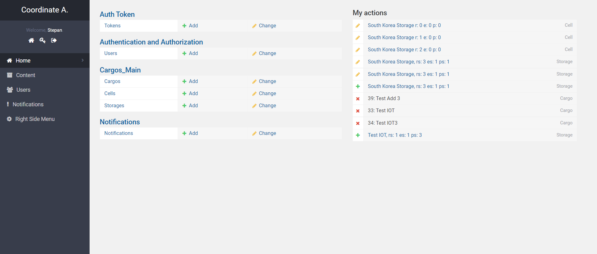

# Warehouse Management System (WMS) 📦🤖

Unleash the power of automation and intelligent logistics management in your warehouse with our all-encompassing Warehouse Management System. Built with Django, Vue.js, Kotlin, and Raspberry Pi, our solution caters to managers, workers, and admins, modernizing your warehouse operations.

## Components 🛠️

- **Frontend**: Crafted with [Vue.js](https://vuejs.org/), providing a seamless UI experience.
- **Backend**: Engineered with [Django](https://www.djangoproject.com/), the high-level Python Web framework.
- **Mobile Application**: Developed in [Kotlin](https://kotlinlang.org/), ensuring compatibility and responsiveness across Android devices.
- **IoT**: Empowered by [Raspberry Pi 3B](https://www.raspberrypi.org/products/raspberry-pi-3-model-b/), coded in Python to integrate automation hardware seamlessly.

## Features 🌟

- **Package Tracking**: Real-time package tracking within the warehouse.
- **Efficient Placement Algorithm**: A novel algorithm to optimize the placement and retrieval of packages, ensuring maximum efficiency.
- **Role-Based Access**: Customized interfaces and functionalities for workers, managers, and admins.
- **Robotics & Automation Integration**: Lay the groundwork for the future, with support for robotics and automated systems in logistics management.

## Setup & Installation 🚀

### Prerequisites

- Python 3.x
- Node.js and npm (for Vue.js)
- Android Studio (for Kotlin mobile app)
- Raspberry Pi 3B setup

### Installation

1. **Backend Setup**:
   ```bash
   cd backend
   pip install -r requirements.txt
   python manage.py migrate
   python manage.py runserver
    ```
   
<hr>

## Demo 🤖
<h6>Auth page</h6>
 <br>
<h6>Main page</h6>
 <br>
<h6>Search</h6>
 <br>
<h6>Search reasult</h6>
 <br>
<h6>Localization and "the latest news"</h6>
 <br>
<h6>Cargo delivery</h6>
 <br>
<h6>Cargo preview</h6>
 <br>
<h6>Cargo update</h6>
 <br>
<h6>New cargo form</h6>
 <br>
<h6>Notifications page</h6>
 <br>
<h6>Admin panel</h6>
 <br>

<h6>Auth page</h6>
 <br>
<h6>Notifications page</h6>
 <br>
<h6>Cargo preview</h6>
 <br>
<h6>Cargo search page</h6>
 <br>
<h6>Main page</h6>
 <br>
<br>

 

## License 📜

This project is licensed under the MIT License. See the [LICENSE.md](LICENSE.md) file for details.
